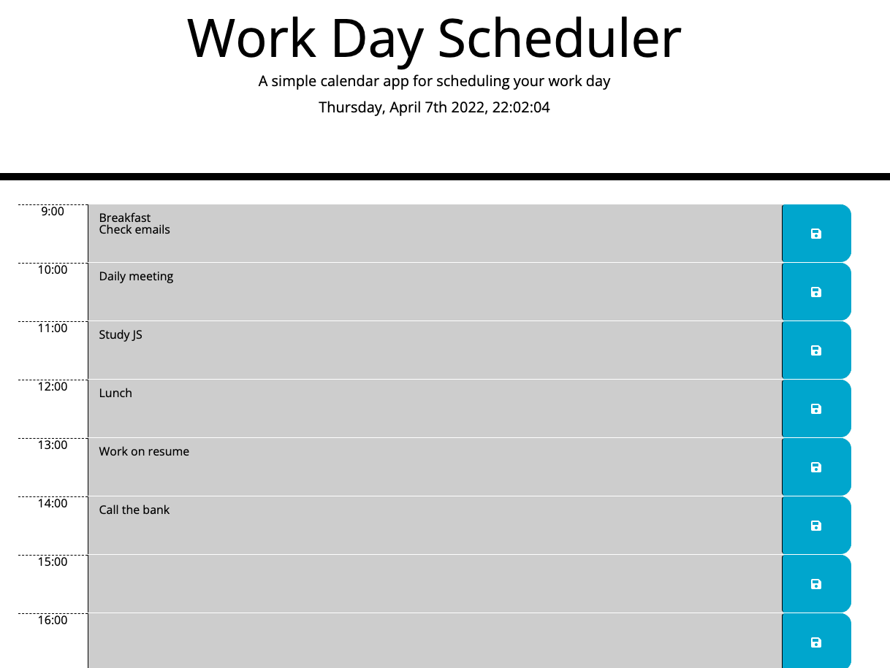

# daily-planner ✨
This daily planner helps manage time effectively by adding important events to a calendar and save them for each hour of the day.

## Tech
This simple calendar application allows users to save events for each hour of the day. This app features dynamically updated HTML and CSS powered by jQuery.

We are also using [Moment.js](https://momentjs.com/) library for the date and time. and Bootstrap for css. 

## App functionality

The current day is displayed at the top of the calendar
- Timeblocks available for standard business hours
- Each timeblock is color coded to indicate whether it is in the past, present, or future
- It allows user to click into a timeblock, enter an event and then click the save button for that timeblock
- The text for that event is saved in local storage
When refreshing page, the saved events persist

### Mock-up

### App links

| Description   | URL |
| -----------   | ------ |
| Deployed App  | [https://efrech.github.io/daily-planner/]     |
| GitHub Repo.  | [https://github.com/efrech?tab=repositories]  |

